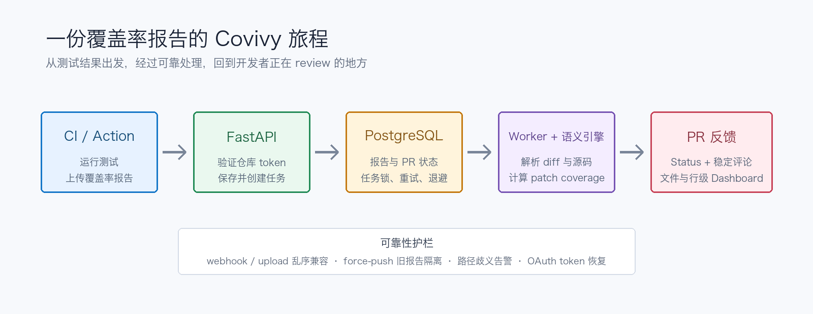

# 总覆盖率 90%，新代码却没测：我做了一个专盯 PR 的覆盖率工具

> 项目总覆盖率是全班平均分，Covivy 更关心这次交作业的人到底写没写。

有一种很有迷惑性的绿色，叫作 CI 页面上的 `Coverage 90%`。

它看起来稳重、可靠，像一位从不迟到的老员工。直到你打开刚提交的 Pull Request，发现新增的 40 行核心逻辑一行测试都没有。那 90% 主要来自三年前写下、此后再也没人敢碰的代码。

总覆盖率没有撒谎，它只是回答了另一个问题：**整个项目有多少代码被测试执行过？**

而开发者在 review 一个 PR 时真正想问的是：

> **这次新增和修改的代码，有多少真的被测试覆盖了？**

这就是 [Covivy](https://github.com/Ivyzhang/covivy) 想解决的问题。

## 一句话认识 Covivy

Covivy 是一个开源、自托管、面向 Pull Request 的代码覆盖率服务。CI 把 Cobertura、LCOV 或 Go coverprofile 报告交给它，它再结合 PR diff 和源码，计算这次改动的 **patch coverage**，最后把结果送回 GitHub：

- commit status 告诉你质量门禁通过没有；
- 一条稳定更新的 PR 评论给出摘要，不会每跑一次 CI 就增加一条新留言；
- Dashboard 展示文件和行级别的缺失覆盖，让“覆盖率不够”变成“这几行需要补测试”。

它不是把一个百分比换个颜色再显示一次。它试图让覆盖率真正进入 code review，而不是只在季度质量报告里露个脸。



## 为什么不能只数 diff 里的行

最简单的 patch coverage 算法似乎很诱人：拿到 PR 新增行，去覆盖率报告里查命中次数，然后做除法。听起来十分钟就能写完，剩下五十分钟用来给项目取名字。

问题是，代码不是 Excel 表格。

下面这些新增行通常不应该进入“需要执行的代码”分母：

- Python 的空行、注释和多行语句中的结构行；
- TypeScript 的 `interface`、类型声明、type-only import/export 和 ambient declaration；
- Go 中只有花括号或结构作用的行；
- 测试文件，以及团队明确配置忽略的路径。

如果把它们一股脑算进去，覆盖率会因为一行 `}` 没被“执行”而下降。右花括号对此表示无辜，它甚至没有 CPU 使用权。

Covivy 因此做了语义化判断：

- **Python** 使用标准库 AST，把变更行关联到最小的可执行语句；
- **JavaScript/TypeScript** 调用 TypeScript Compiler API，区分运行时代码和类型系统内容；
- **Go** 展开 coverprofile 的覆盖区块，同时排除注释和纯结构行。

当语义分析无法确定一行是否应该覆盖时，Covivy 不会偷偷把它算作已覆盖。保守一点，也比做出一个漂亮但虚假的数字更有用。

## 三种报告，先说同一种语言

Python、JavaScript 和 Go 的覆盖率工具各有表达方式：Cobertura XML、LCOV、Go coverprofile 看起来像三个部门各自设计的报销表。

Covivy 先把它们归一化成同一个模型：

```text
CoverageReport
  -> CoveredFile(path)
       -> CoveredLine(number, hits, branch, condition coverage)
```

统一之后，后面的 diff 匹配、语义判断、文件汇总和 PR 门禁不必为每种语言重写一遍。

路径匹配也不能靠“看着差不多”。CI 工作目录、monorepo 前缀和报告工具可能让同一个文件拥有不同路径。Covivy 会清理常见 workspace 前缀，并在唯一匹配时使用路径后缀；如果存在多个候选，它会给出 warning，而不是随便挑一个幸运文件。

## 一份报告在 Covivy 里经历了什么

让我们跟着一次 PR 覆盖率上传走完整条链路。

### 1. CI 负责生产原料

测试仍然由你熟悉的工具执行。Python 生成 Cobertura，前端项目生成 LCOV，Go 生成 coverprofile。Covivy 提供了 composite GitHub Action 和独立 shell uploader，负责把报告以及仓库、commit、branch、PR 信息上传。

```yaml
- name: Upload coverage to Covivy
  if: github.event_name == 'pull_request'
  uses: Ivyzhang/covivy/upload-action@main
  with:
    token: ${{ secrets.COVIVY_UPLOAD_TOKEN }}
    base-url: ${{ vars.COVIVY_BASE_URL }}
    coverage-file: coverage.xml
    format: cobertura
```

### 2. API 快速收件，Worker 慢慢拆包

FastAPI 接口验证仓库级上传 token，保存原始报告，记录 commit 和 PR，然后把解析任务放进 PostgreSQL。

真正耗时的报告解析、GitHub API 请求、源码获取和语义分析交给 Worker。这样上传请求不必站在门口等所有工作做完，也不会因为 GitHub 临时变慢就一直占着连接。

Worker 使用数据库行锁和 `SKIP LOCKED` 领取任务。多个 Worker 可以并行工作，但不会围着同一个任务说“我来”“还是我来”。失败任务会重试并采用指数退避，达到最大次数后才正式判定失败。

### 3. 世界并不按理想顺序发送事件

覆盖率上传和 GitHub webhook 谁先到，没有人能保证。

Covivy 的处理逻辑允许二者乱序：上传可以先创建或补全 PR 状态，webhook 也可以先同步安装信息和 PR head。系统依靠可重复的 upsert 和后续任务把信息拼完整，而不是假设网络世界排着整齐的队。

force-push 更麻烦。旧 commit 的报告可能在新 commit 推送后才完成处理。如果直接发布，它会给已经不存在的代码盖章。Covivy 在生成 PR 反馈前会再次比较报告 commit 和当前 `head_sha`，旧报告会被隔离，不覆盖新结果。

### 4. 结果回到开发者工作的地方

分析结果最终写入 commit status、稳定 PR 评论和 Dashboard。开发者不必从 review 页面跳到某个只有管理员记得密码的监控系统，才能知道哪一行缺测试。

这也是 Covivy 最重要的产品判断：**质量工具应该出现在决策发生的地方。**

## 为什么选择自托管

覆盖率报告不只是一个百分比。它可能包含仓库路径、源码结构、分支信息、PR 元数据，甚至足以推断业务模块的活跃程度。

Covivy 使用自托管模式，让团队决定数据放在哪里、保存多久、谁能访问。每个仓库拥有独立的 `cov_...` 上传 token，数据库只保存其 HMAC 哈希；管理员 token、webhook secret、Dashboard session secret 和仓库上传 token 各司其职，不拿一把万能钥匙开所有门。

GitHub App 使用安装级 token 获取仓库内容、PR 和状态权限；OAuth 用于 Dashboard 登录与仓库发现。最近加入的 token 自动刷新与并发刷新保护，也是在处理一个很现实的问题：外部身份有效期和本地登录会话从来不会默契地同时到期。

自托管当然不是免费午餐。你需要维护 PostgreSQL、API、Worker、存储、HTTPS 和密钥。Covivy 的选择不是“运维不存在”，而是“数据和质量门禁由你掌控”。

## 这个项目不只是一个覆盖率公式

如果你是招聘者或技术面试官，Covivy 展示的并不是“会写一个 FastAPI CRUD”。它把多个容易在真实系统中出问题的边界放在了一起：

| 工程问题 | Covivy 的处理方式 |
| --- | --- |
| 多语言输入 | 统一 Cobertura、LCOV、Go coverprofile 数据模型 |
| 源码语义 | Python AST、TypeScript Compiler API、Go 结构行判断 |
| 异步可靠性 | PostgreSQL job queue、行锁、`SKIP LOCKED`、重试和退避 |
| 分布式事件顺序 | webhook/upload 乱序兼容和幂等 upsert |
| 历史结果污染 | force-push 后按当前 PR head 隔离旧报告 |
| 第三方集成 | GitHub App、OAuth、commit status、稳定 PR 评论 |
| 权限与凭据 | 仓库级上传 token、哈希存储、不同 secret 权责分离 |
| 可行动反馈 | 从项目百分比下钻到 PR、文件和具体变更行 |

它体现的是一种工程习惯：不只实现 happy path，还要认真面对重复事件、过期凭据、并发 Worker、路径歧义和迟到的数据。因为生产环境最擅长的事情，就是找到流程图箭头之间没写出来的那条路。

## 谁适合试试 Covivy

Covivy 比较适合：

- 希望为新代码设置独立覆盖率门禁的团队；
- 不能或不愿把覆盖率与源码元数据交给外部 SaaS 的组织；
- 同时维护 Python、JavaScript/TypeScript 或 Go 项目的团队；
- 想研究覆盖率平台、GitHub App 或异步任务系统的开发者；
- 需要一个有真实工程边界、能在面试中深入讲解的开源项目的人。

它暂时不适合期待“注册账号、填信用卡、五分钟获得全球托管 SLA”的用户。Covivy 是自托管项目，需要你拥有自己的运行环境。

另外需要明确：**当前 GitHub 已具备完整的覆盖率上传和 PR 反馈链路；GitLab 已完成 OAuth、仓库发现和 provider API 基础能力，但异步 Merge Request 覆盖率反馈仍在建设中。**

## 五分钟看懂如何开始

完整部署与 GitHub App 权限说明请阅读[项目 README](https://github.com/Ivyzhang/covivy#quick-start)。本地体验的主路径是：

```bash
git clone https://github.com/Ivyzhang/covivy.git
cd covivy

docker compose up -d postgres
python3 -m venv .venv
.venv/bin/pip install -r requirements-dev.txt
npm ci
cp .env.example .env

# API 和 Worker 在宿主机运行时，让它们连接映射到 localhost 的 PostgreSQL
sed -i.bak 's/@postgres:5432/@localhost:5432/' .env

.venv/bin/alembic upgrade head
.venv/bin/uvicorn app.main:app --host 127.0.0.1 --port 8000
```

在另一个终端启动 Worker：

```bash
.venv/bin/python -m app.worker
```

访问 `http://127.0.0.1:8000`，然后根据 README 配置 GitHub App、仓库上传 token 和 CI Action。

## 最后：让覆盖率回到它应该回答的问题

覆盖率不是代码质量的充分条件。100% 覆盖的测试也可能只是在非常认真地断言 `True is True`。

但覆盖率仍然是有价值的信号，前提是它离当前改动足够近、能指出具体问题，并且不会用历史代码的高分替新代码打掩护。

Covivy 想做的事情很简单：当一个 PR 说“我准备好了”，给 reviewer 多一份具体、及时、可以行动的证据。

- 仓库：[github.com/Ivyzhang/covivy](https://github.com/Ivyzhang/covivy)
- Issue 与建议：[提交反馈](https://github.com/Ivyzhang/covivy/issues)
- 部署文档：[README](https://github.com/Ivyzhang/covivy#quick-start)

如果这个方向对你的团队有用，可以从一个测试仓库开始接入。最坏的结果是多看到几行没测的代码；通常它们本来就在那里，只是以前比较擅长保持安静。

---

